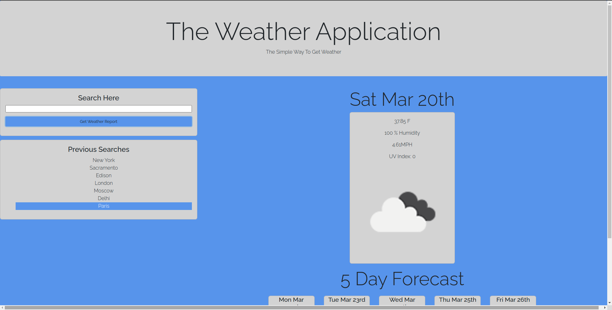
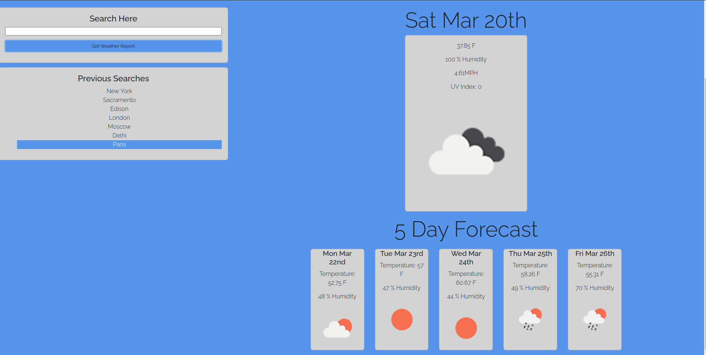
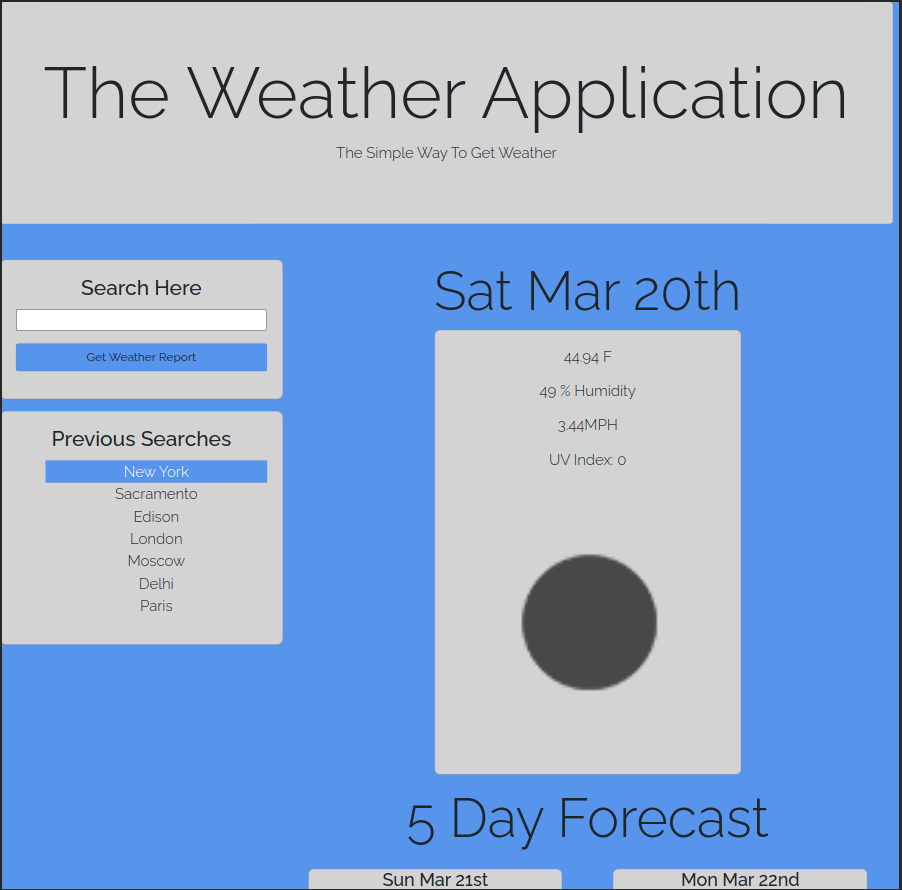
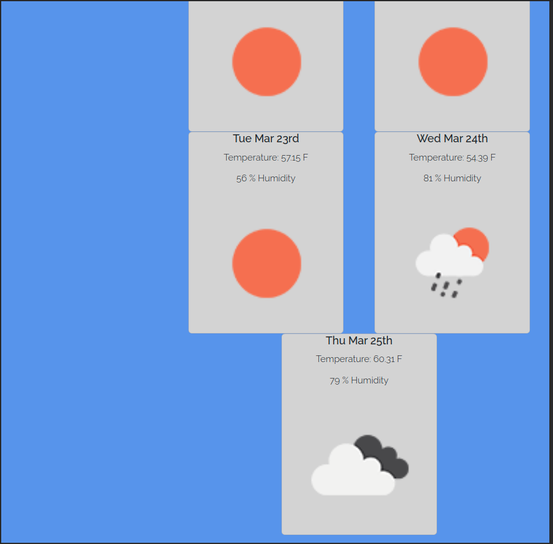

# The Weather Application

## Description

This is a simple weather search application that takes a city name as input, and displays the current weather and a five day forecast for that city.

## Expected Behavior

1. When the User first loads the application, they will be greeted with a search form, asking them to fill it out and search.
1. When a city is filled out and the button clicked, the application will render the current weather, then below it 5 cards indicating a five day forecast.
1. The cities that have been searched for will be displayed in a list below the search form (these are stored in localStorage).
1. The application displays a responsive layout, changing the layout the various cards that hold the information as the screen decreases in width.

## Application

### Deployment

The deployment of the application can be found at the following [link](https://thebadams.github.io/weather-application)

The application's code can be browed in its [repository](https://www.github.com/thebadams/weather-application)

### Screenshots

## Contact Me
 You can contact me in the following places:

 My [GitHub Profile](https://www.github.com/thebadams)

 My [LinkedIn Profile](https://www.linkedin.com/in/brian-adams-5a410b53/)

 By [Email](mailto:bpeteradams@gmail.com)